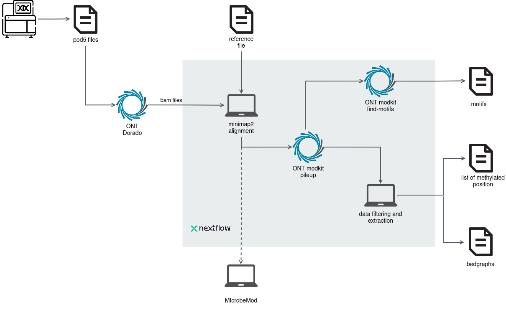

# Nextflow pipeline for extracting bacterial methylation sites and motifs from Nanopore data


This pipeline processes basecalled reads generated by [**Dorado**](https://github.com/nanoporetech/dorado), with DNA modification basecalling required. It extracts methylated positions along a reference genome and identifies specific motifs using [**Modkit**](https://github.com/nanoporetech/modkit).

Schematic overview of the pipeline:




## Input

- **Basecalled reads**:  Outputs from Dorado in BAM file format, which include basecalled DNA modifications. See [[Basecalling with Dorado]([https://github.com/valegale/ONT_methylation/wiki/Usage](https://github.com/rki-mf1/ont-methylation/wiki/Basecalling-with-Dorado))](https://github.com/rki-mf1/ont-methylation/wiki/Getting-Started-with-ONT%E2%80%90methylation) for details. To verify that modification information is present, check that the BAM file contains the `MM` and `ML` tags.
- **Reference file**: A reference genome or sequence against which the reads will be aligned. The assembly obtained from the BAM files is recommended (e.g., by _de novo_ assembly with [flye](https://github.com/mikolmogorov/Flye)). 

## Output

- **Motif analysis with Modkit**: Identified motifs based on DNA modifications using Modkit.
- **Statistical analysis**: Summary statistics of the methylation status for each contig in the reference genome.
- **List of methylated positions**: A list of methylated positions relative to the reference genome, including only those with a confidence level above a custom threshold.
- **BedGraph files for IGV visualization** BedGraph files produced by Modkit and custom refined BedGraph files are provided, displaying methylation confidence for each base. These files can be loaded into [IGV](https://igv.org/) for visualization as annotation tracks.


## Requirements

### **Workflow management and dependencies** 

You need to install [Nextflow](https://www.nextflow.io/docs/latest/install.html) to run the pipeline. We recommend installing Nextflow using `curl`:

```bash
curl -s https://get.nextflow.io | bash
```

However, if this does not work for you, you can also install Nextflow via [conda](https://docs.anaconda.com/miniconda/) or [mamba](https://mamba.readthedocs.io/en/latest/installation/micromamba-installation.html).

To avoid installing all necessary tool dependencies manually, we recommend using [Docker](https://docs.docker.com/get-started/get-docker/) or [Singularity](https://docs.sylabs.io/guides/3.0/user-guide/installation.html). Nextflow will then handle all your dependencies using the Docker or Singularity profile (see below). Alternatively, pre-configured conda environments are also available in the pipeline (see [Running with Containers](#Running-with-containers) for details on how to use containers). 

## How to install and update the pipeline

To install the pipeline, simply use Nextflow:

```bash
nextflow pull rki-mf1/ont-methylation
# check available release versions and branches:
nextflow info rki-mf1/ont-methylation
# show the help message for a certain pipeline release version:
# ATTENTION: check for the latest release version or exact version you want to use! 
nextflow run rki-mf1/ont-methylation -r 0.0.1 --help
# update the pipeline simply via pulling the code again:
nextflow pull rki-mf1/ont-methylation
```

**Check to use the latest pipeline release version**. To have reproducible results, use the same version. 

You can also `git clone` this repository and run the pipeline via `nextflow run main.nf` - but we do not recommend this. 

## How to Run

For a brief introduction and a step-by-step example of running the pipeline, see the wiki page [Getting Started with ONT‐methylation](Getting Started with ONT‐methylation) for a small introduction and a practical example on how to run the pipeline. 

To run the pipeline with a single reference and BAM file, use the following command (**adjust the `-r` version as necessary**):

```bash
# ATTENTION: check for the latest release version or exact version you want to use! 
nextflow run rki-mf1/ont-methylation -r 0.0.1 --fasta sample_test.fasta --bam sample_test.bam
```
**Warning:** The names of the FASTA and BAM files must match (excluding the file extension).

   
- **fasta** specifies the reference genome file in FASTA format.
- **bam** specifies the basecalled BAM file output from Dorado.

If you have multiple references and BAM files, you can provide them using wildcard patterns (`*`). For example:

```bash
# ATTENTION: check for the latest release version or exact version you want to use! 
nextflow run rki-mf1/ont-methylation -r 0.0.1 --fasta '*.fasta' --bam '*.bam'
```

**Don't forget the single ticks `'...'`!**

Also in this case, ensure that the base names of the FASTA and BAM files match exactly. This matching allows the pipeline to correctly associate each reference with its corresponding BAM file.

For complex cases with numerous references and BAM files, you can also use the `--list` parameter to specify CSV files as input instead of the direct paths to the files. This approach offers flexibility by allowing each reference and BAM file pair to be listed explicitly.

For example:

```bash
# ATTENTION: check for the latest release version or exact version you want to use! 
nextflow run rki-mf1/ont-methylation -r 0.0.1 --list --fasta references.csv --bam mappings.csv
```

The `references.csv` file should contain the sample name and path to each reference FASTA file:

```csv
sample1,/path/to/reference1.fasta
sample2,/path/to/reference2.fasta
sample3,/path/to/another/reference3.fasta
```

The `mappings.csv` file should list the sample name (matching the `references.csv`) and path to each BAM file:

```csv
sample1,/path/to/mapping1.bam
sample2,/path/to/mapping2.bam
sample3,/path/to/another/mapping3.bam
```

### Running the pipeline on metagenomic data

It is also possible to run the pipeline starting from metagenomic data, using the `-meta` option. In this scenario, the assembly and binning must be performed separately before running the pipeline. The pipeline expects the following inputs:

1. A **BAM file** produced by Dorado containing basecalled reads with modification information.  
2. A **FASTA file** containing the polished assembly of the metagenome.  
3. A **bin folder**, where each bin is already separated into individual FASTA files. The path to this folder should be provided to the pipeline using the `--bins_folder` parameter.


For simplicity, only **one metagenome** can be processed at a time, meaning one BAM and one FASTA file should be provided.  

A practical example and step-by-step instructions are available on the wiki page [Getting Started with ONT-methylation](https://github.com/rki-mf1/ont-methylation/wiki/Metagenomic-pipeline-example-(%E2%80%90meta)).  


### Running with Containers

To run the pipeline using Docker, use the following command:

```bash
# ATTENTION: check for the latest release version or exact version you want to use! 
nextflow run rki-mf1/ont-methylation -r 0.0.1 --fasta sample_test.fasta --bam sample_test.bam -profile docker
```


To run the pipeline with SLURM and conda, use this command:
```bash
nextflow run nextflow pull rki-mf1/ont-methylation --fasta sample_test.fasta --bam sample_test.bam -profile slurm,conda
```

To run the pipeline with SLURM and Singularity, use this command:
```bash
nextflow run nextflow pull rki-mf1/ont-methylation --fasta sample_test.fasta --bam sample_test.bam -profile slurm,singularity
```
   
## Results interpretation

### Modkit tables

The results include a table generated by Modkit, named `modkit_motifs_tsv`, which summarizes the detected motifs. It is recommended to compare the detected motifs and their frequencies to determine if the same motif is modified for multiple modifications (also check the reverse complement of the motifs). Note that the code "21839" corresponds to the 4mC modification.

**Important:** Modkit applies a [confidence threshold](https://github.com/nanoporetech/modkit/blob/master/book/src/filtering.md) to filter modified positions. Only bases with a methylation confidence value above this threshold will be considered methylated.
- You can adjust this value using the `--filter_threshold_modkit` parameter (see also the `--help`). The default is set to 0.75, as values lower than this tend to produce a high number of false positives, while higher values may be overly stringent.
- Alternatively, you can enable `--automatic_threshold_modkit`. In this mode, Modkit will estimate an appropriate threshold from the data automatically by removing the lowest 10th percentile of scores, any value provided via `--filter_threshold_modkit` will be ignored.

The intermediate output file, `modkit_pileup_output.bed`, is a tab-separated file that summarizes all reference positions along with their aggregated results from individual reads. This file serves as input for the next steps in the analysis.

### Methylation Level Statistics

Methylation statistics are stored in the `methylation_statistics` folder. Separate tables are created for each modification, with the percentage of methylation calculated by dividing the number of methylated bases (those exceeding the Modkit threshold) by the total number of relevant bases (A for 6mA, C for 4mC and 5mC).

### List of Methylated Positions and BedGraph files for Visualization

To extract the list of likely methylated positions, the output from Modkit (`modkit_pileup_output.bed`) must undergo filtering and refining (see [How Percent modified is computed](#How-percent-modified-is-computed) for more information). The tables containing these lists are located in the `modification_tables` folder.

Only positions with coverage greater than 10 and a methylation confidence above a specified threshold are included (default = 0.5). This threshold can be adjusted using the parameter `--percent_cutoff_modification_table`.

The BedGraph files generated directly from Modkit can be found in the `bedgraphs` folder, while the preprocessed BedGraph files, which reflect the same values as in the `modification_tables`, are located in the `bedgraphs_customized` folder.

## How "Percent Modified" is Computed

Modkit pileup aggregates the information from all reads for all positions of the reference genome and computes a value called "fraction modified," which represents the percentage of reads with a methylated base for each position. This calculation considers only the reads where the base has passed the confidence threshold; thus, if a position has a high number of reads with bases that didn't meet this threshold, those reads are excluded from the count.

In Modkit (check [Description of bedMethyl output](https://github.com/nanoporetech/modkit#Description-of-bedMethyl-output)), "fraction modified" is defined as N<sub>mod</sub> / N<sub>valid_cov</sub>. In our analysis, we introduce a new metric called "percent modified," computed as: N<sub>mod</sub> / (N<sub>valid_cov</sub> + N<sub>fail</sub> + N<sub>diff</sub>). This approach helps to prevent positions with only a few valid reads from being incorrectly classified as modified. See [Description of bedMethyl output](https://github.com/nanoporetech/modkit#Description-of-bedMethyl-output) for details regarding the before mentioned variables and their definition.

## Searching motifs with Modkit

By default, this pipeline runs Modkit’s motif finding algorithm with its default parameters. In some cases, this step can take a long time because Modkit searches through all possible motif combinations.
If runtime is an issue, or if further exploration to identify additional motifs is desired, it is recommended to install the latest version of Modkit locally and tweak the parameters, as described in the [Modkit documentation](https://nanoporetech.github.io/modkit/intro_find_motifs.html#options-to-decrease-or-limit-search-time), to reduce search time while still identifying meaningful motifs. The BED file produced by this pipeline can be used as input, but the Modkit version used in the pipeline should be checked for compatibility.


## Running MicrobeMod

[MicrobeMod](https://github.com/cultivarium/MicrobeMod) is a popular tool for motif annotation and identification. We recommend comparing the results from Modkit (generated using our pipeline) with those obtained from MicrobeMod for a comprehensive analysis.

MicrobeMod requires the user to align the BAM files generated by Dorado to the reference genome. Since the read extraction from the basecalled BAM format and the alignment to a reference FASTA are the first steps in our pipeline, you can directly run MicrobeMod using the intermediate file `methylation_mapped.bam` as follows:

```bash
MicrobeMod call_methylation -b <path_to_the_results_folder>/methylation_mapped.bam -r genome_reference.fasta
```

## Citation

If you use this pipeline in your research, please cite the following:

Galeone, V., Dabernig-Heinz, J., Lohde, M. et al. Decoding bacterial methylomes in four public health-relevant microbial species: nanopore sequencing enables reproducible analysis of DNA modifications. *BMC Genomics* **26**, 394 (2025). https://doi.org/10.1186/s12864-025-11592-z

